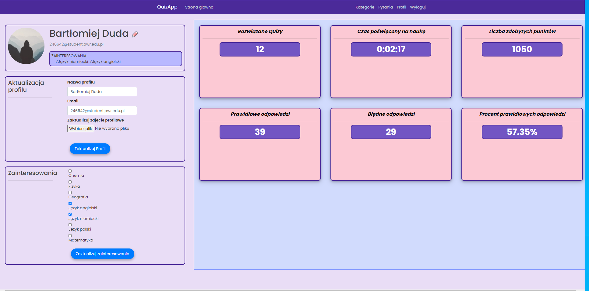

# QuizApp
Simple quiz app in Flask framework. Application allows to create and solve quizzes with randomized answers.

## User Profile:

## Main screen of application:

## Categories:

## User quiz:

